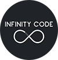
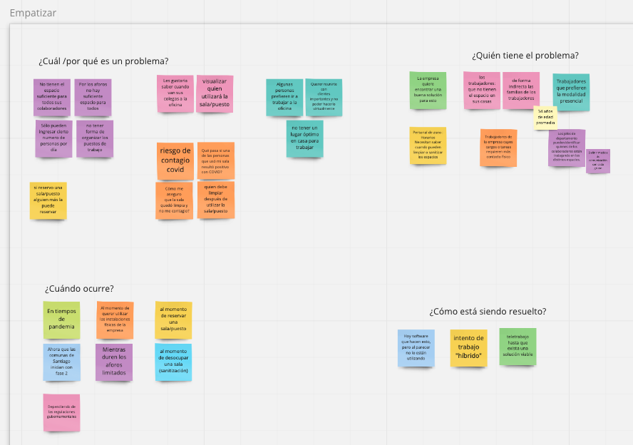
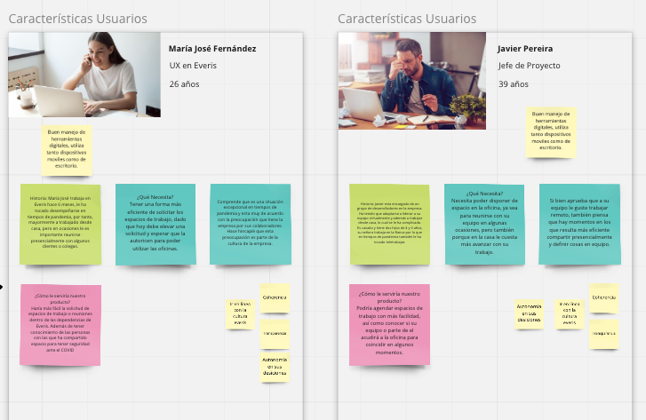
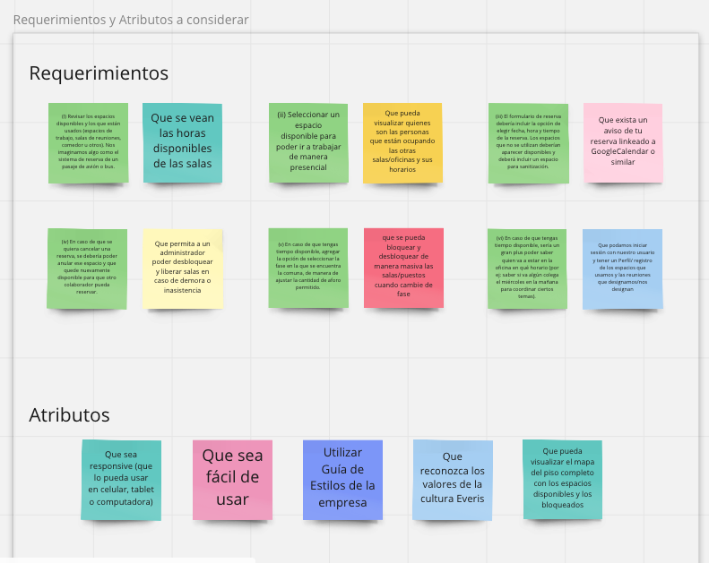
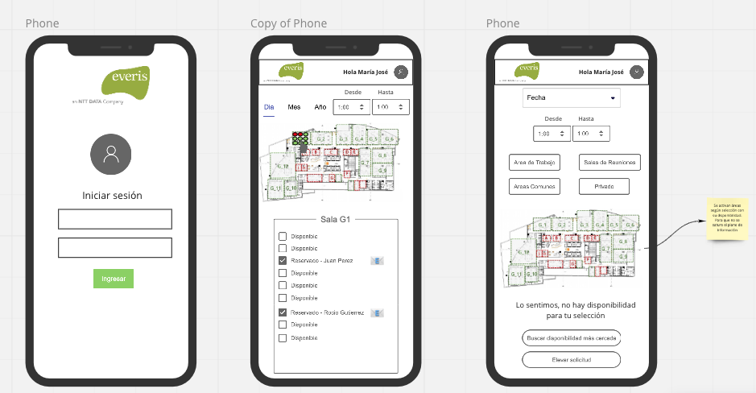
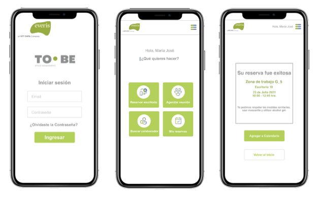
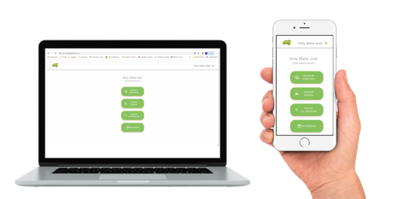

# TO·BE - SPACE MANAGEMENT MODEL 
## 📅 🖥️  Reserva tu escritorio, agenda tus reuniones.

### by
 

## Índice

* [1. Tecnologías/Herramientas utilizadas](#1-tecnologías/herramientas-usadas)
* [2. Preview](#3-preview)
* [3. Definición del producto](#4-definición-del-producto)
* [4. Historias de usuario/Features](#5-historias-de-usuario/features)
* [5. Prototipo](#6-prototipo)
* [6. Test de usabilidad](#7-test-de-usabilidad)

***

## 1. Tecnologías/Herramientas usadas

- React.js
- React Hooks
- Material-Ui
- Firebase/Firestore
- CSS
- GitHub

## 3. Preview

 

[PUEDES PROBAR LO QUE LLEVAMOS HASTA AHORA DEL PRODUCTO HACIENDO CLICK AQUÍ](https://space-management-model.web.app/)

## 4. Definición del producto

¿Quieres ver de qué se trata TO·BE? [CLICK ACÁ](https://vimeo.com/578456869)

_**"To be"**_, del verbo inglés que en presente tiene dos significados SER y ESTAR. 
Plataforma TO·BE es una plataforma que busca acompañar a la Empresa en el proceso de regreso a la oficina haciendo más cómoda, rápida y segura la ubicación de los colaboradores en sus espacios de trabajo.

Es una aplicación web diseñada para los colaboradores de Everis que permite la reserva de escritorios, agendar reuniones, revisar reservas y disponibilidad.
El objetivo de este proyecto es la planificación de espacios de trabajo de forma fácil, eficiente, considerando los aforos en tiempos de pandemia.

Es un producto ideal para utilizar tanto en dispositivo móvil como página web, ya que se maneja de manera responsiva.

El _**público objetivo**_ pensado para este proyecto abarca personas entre **25 - 45 años**, 
usuarios trabajadores de la compañía Everis. Personas  _en su mayoría_ nativas digitales o que se manejan bien con Apps y páginas web.

### DESIGN THINKING

Para comenzar a trabajar este desafío, como Equipo nos planteamos generar una propuesta de proceso creativo ligada con herramientas de Design thinking que nos permitieron profundizar en la problemática y empatizar mejor con los usuarios. (Y trabajar de manera colaborativa y creativa de forma remota)

Dividimos la necesidad del cliente en base a cuatro preguntas: 

- ¿Cuál y por qué es un problema?
- ¿Quién tiene ese problema?
- ¿Cuándo ocurre este problema?
- ¿Cómo está siendo resuelto actualmente?

 

Esto dio lugar a la creación de dos usuarios tipo, por un lado, una persona que le acomoda el teletrabajo, pero que eventualmente debe asistir a reuniones con clientes o con algún colega y que para hacerlo en las condiciones actuales, debe realizar una solicitud que hace poco fluido el proceso, le toma tiempo y no siempre es efectivo. Por otro lado, una persona que le acomoda el contacto físico al trabajar ya que gran parte de su trabajo requiere relaciones públicas; o que en su defecto  tiene a cargo grupo de colaboradores dentro de la misma empresa y le gustaría poder intercambiar diálogo con ellos demanera más fluida. Por otra parte, es una persona quien no posee un espacio adecuado para deasrrollar el teletrabajo de manera óptima en su hogar.

 

El análisis  de estos dos usuarios nos llevó a definir atributos para la aplicación web, además de comprender y revisar los requerimientos a la luz de las necesidades de estas personas.

 

Una vez definidos y comprendidos estos atributos y requerimientos, dimos una mirada a sitios web que permiten la reserva de espacios, por ejemplo, vuelos, horas médicas, hoteles. 

Para ver el trabajo de Research completo  puedes hacer click [AQUÍ](https://miro.com/app/board/o9J_l6vv8Yk=/)

## 5. Historias de usuario

        - HU 1. "Como usuario quiero revisar los espacios disponibles y los que están usados (espacios de trabajo, salas de reuniones, comedor u otros). Para ver mis opciones de ir a la oficina.".

        - HU 2. "Como usuario quiero seleccionar un espacio disponible para poder ir a trabajar de manera presencial.".

        - HU 3. "Como administrador quiero que muestre fecha, hora y tiempo de reserva considerando un espacio para sanitización."

        - HU 4. "Como usuario quiero poder eliminar una reserva para que el espacio quede disponible si no lo utilizaré."

        - HU 5. "Como usuario quiero ver cuales de mis compañeros están en la oficina para contactarlos."

        - HU 6. "Como usuario quiero recibir un mensaje y correo para saber cuando mi reserva este confirmada"

        - HU 7. "Como usuario quiero iniciar sesión con mi correo y contraseña para ingresar a la aplicación."

## 6. Prototipo

### DISEÑO DE BAJA FIDELIDAD

 

Se diseñó un prototipo que cumpliera con las condiciones básicas pedidas por los usuarios, que 
sea 
interactivo y de fácil acceso. A esta primera interacción le buscamos una estética lúdica que 
incentivara el uso de la red social.

## DISEÑO DE ALTA FIDELIDAD

Puedes revisar el diseño completo, visitando este [LINK](https://www.figma.com/proto/YZxKJdApabfqqoN4lVm85W/infinity-code-team-library?node-id=347%3A42&scaling=scale-down)

### DISEÑO FINAL

 - Versión Desktop

 

## 7. Test de usabilidad
 
El producto sigue en construcción para ir mejorando la calidad y la experiencia para el usuario.
